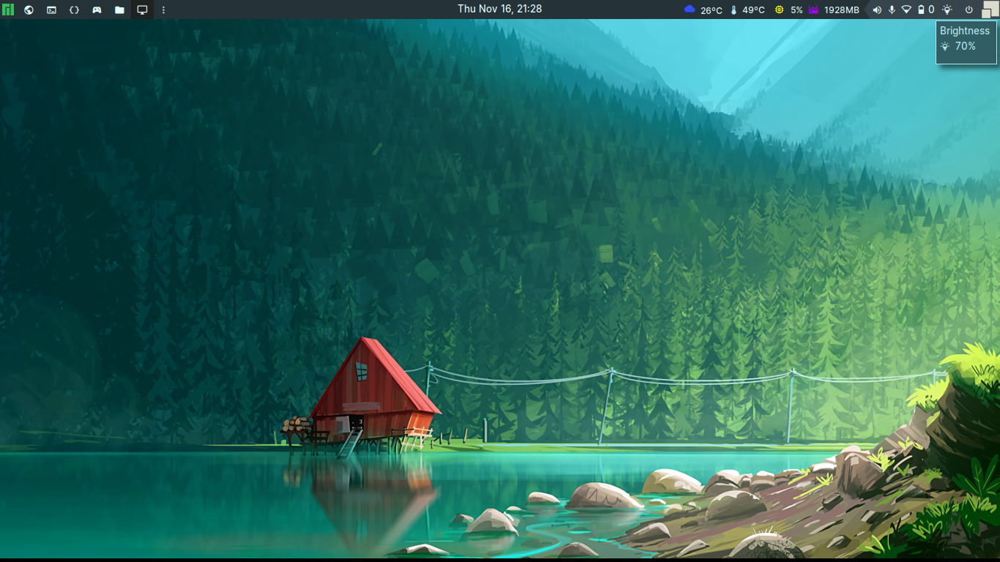

# About

This repository includes my dot files and lua scripts for Awesome Window Manager.

This theme was named *Ebenezer* 🪨, which meaning "stone of helper.".

>> The quote is from I Samuel 7. After defeating the Philistines, Samuel raises his *Ebenezer*, declaring that God defeated the enemies on this spot. As a result, "hither by thy help I come."  So I hope this stone helps you in your environment and, more importantly, in your life. 🙏🏿


# Requirements

I use Manjaro, and the packages listed below are used to support this Awesome WM theme.

- [picom-git](https://aur.archlinux.org/packages/picom-git)
- [inter-font](https://archlinux.org/packages/extra/any/inter-font/)
- [ttf-material-icons-git](https://aur.archlinux.org/packages/ttf-material-icons-git)
- [ttf-hack-nerd](https://archlinux.org/packages/extra/any/ttf-hack-nerd/)
- [ttf-font-awesome](https://archlinux.org/packages/extra/any/ttf-font-awesome/)
- [scrot](https://archlinux.org/packages/extra/x86_64/scrot/)
- [xclip](https://archlinux.org/packages/extra/x86_64/xclip/)
- [i3color](https://aur.archlinux.org/packages/i3lock-color)

# Dependencies

- [awesome-widgets](https://github.com/streetturtle/awesome-wm-widgets)
- [awesome-buttons](https://github.com/streetturtle/awesome-buttons)
- [lain](https://github.com/lcpz/lain)

There are no *luarocks* dependencies, but the following packages are used directly:

- [Lua INI Parser](https://github.com/Dynodzzo/Lua_INI_Parser)
- [awesomewm-screenshot](https://github.com/denisoster/awesomewm-screenshot)

# Settings

This theme is inspired at [polybar](https://github.com/polybar/polybar) settings, supporting ini file (**~/.config/awesome/config.ini**) to configure bars a desktop behaviors.


```ini
[environment]
modkey=Mod4
weather_api_key=api_weather_key # openweathermap.org
city_id=your_city_id # openweathermap.org
logo=$THEMES/icons/tux.png

[commands]
lock_screen=~/.config/i3lock/run.sh

[wm_class]
browsers=firefox chromium-browser microsoft-edge
editors=code-oss sublime atom

[topbar]
left_widgets=tag_list separator task_list
right_widgets=weather arrow_layoutbox

[startup]
picom=picom --config $THEMES/picom.conf
```

You can modify many behaviors and styles in the ini file rather than customizing 
everything at lua.

# How to install

Install all prerequisites first, then run the script below to prepare the dotfiles.

>> Please **ATTENTION** configurations $HOME/.config/{awesome,kitty,xrandr,i3lock} will be overwritten.

```shell
(cd /tmp && git clone https://github.com/williampsena/awesome-wm-dotfiles)
cp -R /tmp/awesome-wm-dotfiles/{awesome,kitty,xrandr,i3lock} ~/.config

# If no config.ini exists, this action will create one with the default parameters.
cp -n ~/.config/awesome/config.default.ini ~/.config/awesome/config.ini
```

Reload your environment, **ModKey + R**.

# Screenshot

- Nov 16, 2023




# TODO

- The Pacman widget in the topbar is not effectively designed.
- Add apt widget support.
- Move systray to a popup or dropdown menu.
- Improve wifi widget information.
- Improve the brightness of notification lights.
- Improve notification sound.
- Build install script.