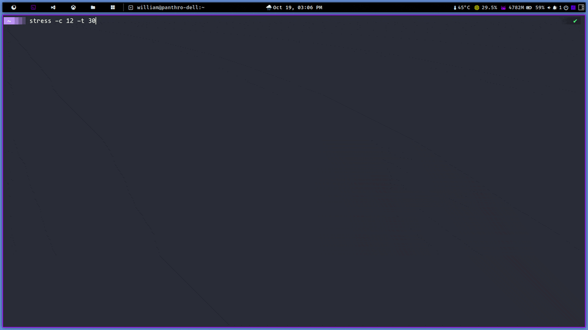
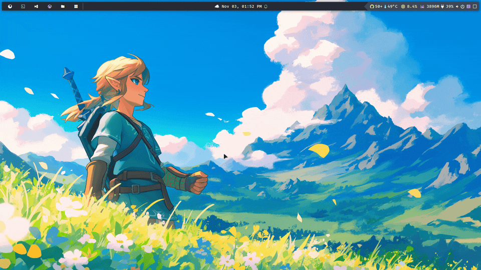
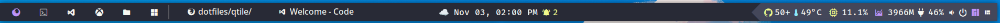

# About


This repository includes my dot files and python scripts for Qtile.

This theme was named *Ebenezer* 🪨, which meaning "stone of helper.".

> The quote is from I Samuel 7. After defeating the Philistines, Samuel raises his *Ebenezer*, declaring that God defeated the enemies on this spot. As a result, "hither by thy help I come."  So I hope this stone helps you in your environment and, more importantly, in your life. 🙏🏿

🚜👷🚧🏗️ This setup is under building; I'm switching my dotfiles inspired setup from Awesome Lua to Python.

# Installing

```shell
pacman -S install dunst ttf-dejavu ttf-iosevka-nerd brightnessctl arc-gtk-theme ttf-firacode-nerd ttf-hack-nerd unclutter nerd-fonts-inter ttf-fira-sans python-pyaml python-pulsectl-asyncio python-dbus-next python-psutil python-pytest-subtests python-pulsectl-asyncio pulsemixer papirus-icon-theme pavucontrol xautolock scrot i3lock flameshot feh lxsession network-manager-applet nm-connection-editor nm-applet picom-git yq tk pacmac-gtk3 polkit-gnome qt5ct qt6ct

DOTFILES_PATH="$HOME/dotfiles"
mkdir -p $DOTFILES_PATH

ln -sf $DOTFILES_PATH/qtile $HOME/.config/qtile  
ln -sf $DOTFILES_PATH/dunst $HOME/.config/dunst  
```

# Settings

Now supports yaml format; I started with ini, but Yaml is more flexible for parsers 😎.

```yaml
environment:
  modkey: mod4
  terminal: kitty
  browser: firefox
  wallpaper_dir: /home/foo/wallpapers
  wallpaper_timeout: 60
  os_logo: /home/foo/logos/linux.svg
  theme: ebenezer
  os_logo_icon: 󰌽
  os_logo_icon_color: "#6200EA"
  weather_api_key: foo
  city_id: 1

groups:
  browsers: 
  terminal:  
  editors: 󰘐
  games:   
  files: 󰉋
  win: 󰍲    

groups_layout:
  default: monadtall
  win: tile

startup:
  keyboard_layout: setxkbmap -model abnt2 -layout br && localectl set-x11-keymap br
  dunst: pkill dunst && dunst &


commands:
  screenshot: flameshot gui --clipboard --path ~/Pictures/Screenshots
  screenshot_full: flameshot full --clipboard --path ~/Pictures/Screenshots

floating:
  wm_class:
    - pavucontrol
    - gnome-calculator
  title: []

fonts:
  font: Fira Code Nerd Font Bold
  font_regular: Fira Code Nerd Font Medium
  font_light: Fira Code Nerd Font Light
  font_strong: Fira Code Nerd Font Semibold
  font_strong_bold: Fira Code Nerd Font Bold
  font_icon: Fira Code Nerd Font Medium
  font_size: 14
  font_icon_size: 16

colors:
  # you can choose a defined theme
  # theme: $qtile_home/conf/themes/dracula.yml
  
  fg_normal: "#e0e0e0"
  fg_focus: "#ffffff"
  fg_urgent: "#ff6b6b"
  bg_normal: "#2d2d2d"
  bg_focus: "#1E2320"
  bg_urgent: "#424242"
  bg_systray: "#37444b"
  bg_selected: "#4B636A"
  fg_blue: "#007acc"
  fg_light_blue: "#80d3ff"
  fg_yellow: "#ffcc00"
  fg_red: "#ff3b30"
  fg_orange: "#ff9500"
  fg_purple: "#a94dff"
  fg_green: "#4BC1CC"
  fg_gray: "#a0a0a0"
  fg_white: "#ffffff"
  fg_black: "#000000"
  bg_topbar: "#1E1E1E"
  bg_topbar_selected: "#AA00FF"
  bg_topbar_arrow: "#3E0D5C"
  border_color_normal: "#AA00FF"
  border_color_active: "#6200EA"
  border_color_marked: "#c678dd"
  titlebar_bg_focus: "#2D2D2D"
  titlebar_bg_normal: "#2B2B2B"
  taglist_bg_focus: "#37474F"
  group_focus: "#D4D4D4"
  group_normal: "#C4C7C5"
  lock_screen_blank_color: "#00000000"
  lock_screen_clear_color: "#ffffff22"
  lock_screen_default_color: "#D6A2E8"
  lock_screen_key_color: "#8a8ea800"
  lock_screen_text_color: "#F5F7F8"
  lock_screen_wrong_color: "#E26EE5"
  lock_screen_verifying_color: "#800080"
  lock_screen_joke_foreground_color: "#7A1CAC"
  lock_screen_joke_text_color: "#F5F7F8"


lock_screen:
  command: ~/.config/qtile/lock.py
  timeout: 10
  font_size: 20
  font: /usr/share/fonts/TTF/MononokiNerdFont-Regular.ttf
  joke_providers: reddit,icanhazdad
  joke_foreground_color: "#000"
  joke_text_color: "#fff"
  icanhazdad_joke_url: https://icanhazdadjoke.com/
  reddit_joke_url: https://www.reddit.com/r/ProgrammerDadJokes.json
  blurtype: "0x7"

keybindings:
  - { name: Launch terminal, keys: $mod Return, action: terminal }
  - { name: Launcher, keys: $mod shift Return, action: spawn_command, command: launcher }
  - { name: Launch Window, keys: $mod control Tab, action: spawn_command, command: launcher_windows }
  - { name: Web browser, keys: $mod b, action: browser }
  - { name: Lock Screen, keys: $mod control x, action: lock_screen }

  # qtile keys
  - { name: Reload the config, keys: $mod shift r, action: reload_config }
  - { name: Shutdown Qtile, keys: $mod control q, action: shutdown }

  # window key
  - { name: Toggle between layouts, keys: $mod Tab, action: next_layout }
  - { name: Kill focused window, keys: $mod shift c, action: kill_window }
  - { name: Move focus to left, keys: $mod h, action: focus_left }
  - { name: Move focus to right, keys: $mod l, action: focus_right }
  - { name: Move focus down, keys: $mod j, action: focus_down }
  - { name: Move focus up, keys: $mod k, action: focus_up }
  - { name: Move window focus to other window, keys: $mod space, action: focus_next }
  - { name: Toggle fullscreen on the focused window, keys: $mod f, action: fullscreen }
  - { name: Toggle floating on the focused window, keys: $mod t, action: floating }
  - { name: Move window to the left, keys: $mod shift h, action: shuffle_left }
  - { name: Move window to the right, keys: $mod shift l, action: shuffle_right }
  - { name: Move window down, keys: $mod shift j, action: shuffle_down }
  - { name: Move window up, keys: $mod shift k, action: shuffle_up }
  - { name: Grow window to the left, keys: $mod control h, action: grow_left }
  - { name: Grow window to the right, keys: $mod control l, action: grow_right }
  - { name: Grow window down, keys: $mod control j, action: grow_down }
  - { name: Grow window up, keys: $mod control k, action: grow_up }
  - { name: Reset all window sizes, keys: $mod n, action: reset_windows }

  # screenshot
  - { name: Take a screenshot, keys: print, action: spawn_command, command: screenshot }
  - { name: Take a screenshot of the full desktop, keys: $mod print, action: spawn_command, command: screenshot_full }

  # options
  # - { name: Spawn a command using a prompt widget, keys: $mod r, action: cmd }
```

# Features

## Wallpaper slideshow can be configured in yaml.

```yaml
environment:
  wallpaper_dir: /home/foo/wallpapers
  wallpaper_timeout: 60
```

I intend to create a rofi wallpaper settings; now, we may select random wallpaper from the shell with the following command:

```shell
/home/foo/.config/qtile/ebenezer/scripts/wallpaper.sh set /home/foo/Wallpapers/Active
```
 
## Screenshot desktop, window, delayed and area

- I'm going with flameshot. Scrot is cool and all, but it just doesn't have all the features that flameshot does.

## Launcher (rofi)

> 🚧 Under-construction yet...


## Lock screen (i3lock)

> 🤩 deep inspired in: https://github.com/neo-fetch/shinrai-dotfiles


## Terminal


## Desktop in action

- October 2024


## Monitoring

Colors show how much CPU or memory is being used. You can show the fire icon like I do, or check out the monitoring settings:

```yaml
monitoring:
  default_color: 'fg_normal'
  high_color: 'fg_orange'
  medium_color: 'fg_yellow'
  threshold_medium: 65
  threshold_high: 85
  burn: yes
```



## Theming

Now we can chose a favorite theme and change the colors directly in 'colors.yml' or 'config.yml' if you prefer a single file.

```yaml
colors:
  theme: $qtile_home/conf/themes/dracula.yml

  # override colors
  fg_normal: "#fff"
``` 

> Some theme schema colors are still under construction 🚧.



## Task List with Font Icon

To turn task list icons compatible with bar design, I built an option to use [FontIconTaskList](./qtile/ebenezer/widgets/task_list.py)



# TODO

- Create *Ebenezer* 🪨 python package and github, allowing anyone to use components other than all dotfiles.
- Add apt/pacman widget support.
- Improve wifi widget information.
- Build install script.
- Build rofi applet with user info
- Lock screen with meme support

# Inspirations

- https://github.com/JhonatanFerrer/JhoalfercoQtileDotfiles
- https://gitlab.com/dwt1/dotfiles
- https://github.com/neo-fetch/shinrai-dotfiles
- https://github.com/adi1090x/rofi?tab=readme-ov-file
- https://github.com/SapuSeven/rofi-presets