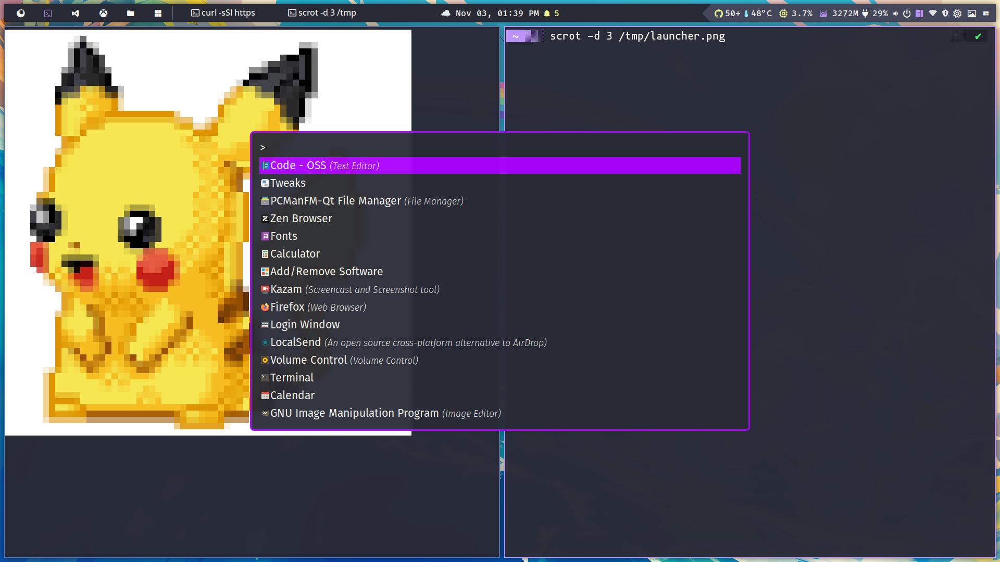
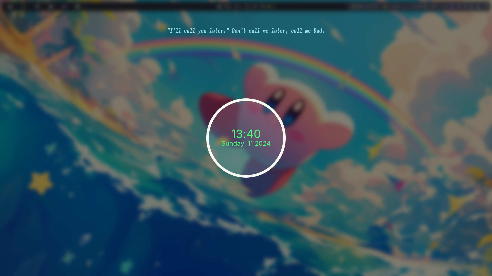
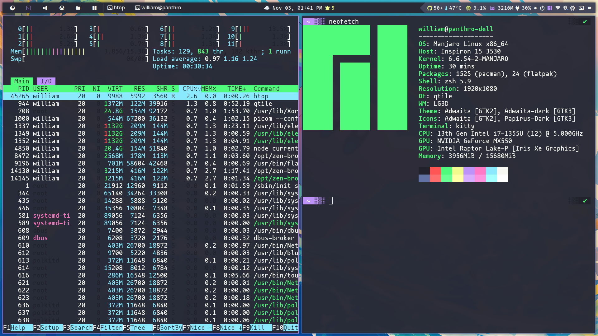
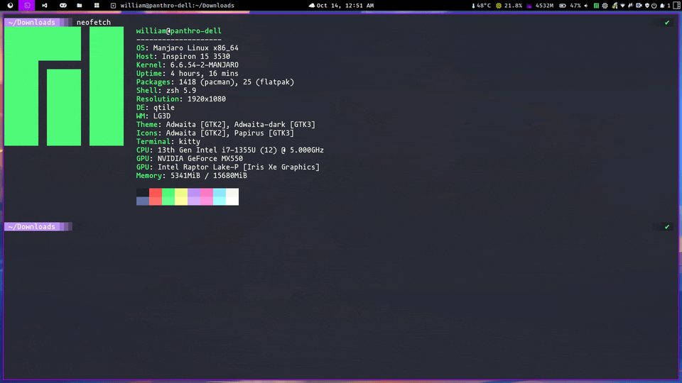

# About

This repository includes my dot files and python scripts for Qtile.

This theme was named *Ebenezer* 🪨, which meaning "stone of helper.".

>> The quote is from I Samuel 7. After defeating the Philistines, Samuel raises his *Ebenezer*, declaring that God defeated the enemies on this spot. As a result, "hither by thy help I come."  So I hope this stone helps you in your environment and, more importantly, in your life. 🙏🏿

🚜👷🚧🏗️ This setup is under building; I'm switching my dotfiles inspired setup from Awesome Lua to Python.

# Installing

```shell
pamac install dunst ttf-dejavu brightnessctl arc-gtk-theme ttf-firacode-nerd ttf-hack-nerd unclutter nerd-fonts-inter ttf-fira-sans python-pyaml python-pulsectl-asyncio python-dbus-next python-psutil python-pytest-subtests python-pulsectl-asyncio pulsemixer papirus-icon-theme pavucontrol xautolock scrot i3lock flameshot feh lxsession network-manager-applet nm-connection-editor nm-applet picom-git yq tk

DOTFILES_PATH="$HOME/dotfiles"
mkdir -p $DOTFILES_PATH

ln -sf $DOTFILES_PATH/qtile $HOME/.config/qtile  
ln -sf $DOTFILES_PATH/dunst $HOME/.config/dunst  
```

# Settings

Now supports yaml format; I started with ini, but Yaml is more flexible for parsers 😎.

```yaml
environment:
  modkey: mod4
  terminal: kitty
  browser: firefox
  wallpaper_dir: /home/foo/wallpapers
  wallpaper_timeout: 60
  os_logo: /home/foo/logos/linux.svg
  theme: ebenezer
  os_logo_icon: 󰌽
  os_logo_icon_color: "#6200EA"
  weather_api_key: foo
  city_id: 1

groups:
  browsers: 
  terminal:  
  editors: 󰘐
  games:   
  files: 󰉋
  win: 󰍲    

groups_layout:
  default: monadtall
  win: tile

startup:
  keyboard_layout: setxkbmap -model abnt2 -layout br && localectl set-x11-keymap br
  dunst: pkill dunst && dunst &


commands:
  screenshot: flameshot gui --clipboard --path ~/Pictures/Screenshots
  screenshot_full: flameshot full --clipboard --path ~/Pictures/Screenshots

floating:
  wm_class:
    - pavucontrol
    - gnome-calculator
  title: []

fonts:
  font: Fira Code Nerd Font Bold
  font_regular: Fira Code Nerd Font Medium
  font_light: Fira Code Nerd Font Light
  font_strong: Fira Code Nerd Font Semibold
  font_strong_bold: Fira Code Nerd Font Bold
  font_icon: Fira Code Nerd Font Medium
  font_size: 14
  font_icon_size: 16

colors:
  fg_normal: "#D8DEE9"
  fg_focus: "#C4C7C5"
  fg_urgent: "#CC9393"
  bg_normal: "#263238"
  bg_focus: "#1E2320"
  bg_urgent: "#424242"
  bg_systray: "#37444b"
  bg_selected: "#5c6b73"
  fg_blue: "#304FFE"
  fg_ligth_blue: "#B3E5FC"
  fg_yellow: "#FFFF00"
  fg_red: "#D50000"
  fg_orange: "#FFC107"
  fg_purple: "#AA00FF"
  fg_green: "#4BC1CC"
  fg_gray: "#9db4c0"
  bg_topbar: "#282a36"
  bg_topbar_selected: "#6200EA"
  bg_topbar_arrow: "#5c6b73"
  border_color_normal: "#AA00FF"
  border_color_active: "#6200EA"
  border_color_marked: "#c678dd"
  titlebar_bg_focus: "#263238"
  titlebar_bg_normal: "#253238"
  taglist_bg_focus: "#37474F"
  group_focus: "#e0fbfc"
  group_normal: "#C4C7C5"

lock_screen:
  command: ~/.config/qtile/lock.py
  timeout: 10
  font_size: 17
  font: /usr/share/fonts/TTF/MononokiNerdFont-Regular.ttf
  joke_providers: reddit,icanhazdad
  joke_foreground_color: "#000"
  joke_text_color: "#fff"
  icanhazdad_joke_url: https://icanhazdadjoke.com/
  reddit_joke_url: https://www.reddit.com/r/ProgrammerDadJokes.json
  blurtype: "0x7"
  blank_color: "#00000000"
  clear_color: "#ffffff22"
  default_color: "#9db4c0"
  key_color: "#8a8ea800"
  text_color: "#4BC1CC"
  wrong_color: "#D50000"
  verifying_color: "#41445800"
```

# Features

## Wallpaper slideshow can be configured in yaml.

```yaml
environment:
  wallpaper_dir: /home/foo/wallpapers
  wallpaper_timeout: 60
```

I intend to create a rofi wallpaper settings; now, we may select random wallpaper from the shell with the following command:

```shell
/home/foo/.config/qtile/ebenezer/scripts/wallpaper.sh set /home/foo/Wallpapers/Active
```
 
## Screenshot desktop, window, delayed and area

- I'm going with flameshot. Scrot is cool and all, but it just doesn't have all the features that flameshot does.

## Launcher (rofi)

> 🚧 Under-construction yet...



## Lock screen (i3lock)

> 🤩 deep inspired in: https://github.com/neo-fetch/shinrai-dotfiles




## Terminal




## Desktop in action

- October 2024




# TODO

- Add apt/pacman widget support.
- Improve wifi widget information.
- Build install script.
- Build rofi applet with user info
- Lock screen with meme support

# Inspirations

- https://github.com/JhonatanFerrer/JhoalfercoQtileDotfiles
- https://gitlab.com/dwt1/dotfiles
- https://github.com/neo-fetch/shinrai-dotfiles
- https://github.com/adi1090x/rofi?tab=readme-ov-file
- https://github.com/SapuSeven/rofi-presets